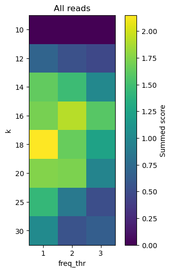

## Assembling contigs using DeBruijn graphs
### authors: Natalia Rutecka, Barbara Jurzysta
Our script aims to assemble contigs from NGS reads. Typical parameters of the input are:
- number of reads: 1000, 
- read length: 80bp,
- average percentage of mismatches: ≤ 5%, 
- average coverage: ≥ 5×.

### Approach
We try to correct infrequent k-mers. Then we build DeBruijn weighted graph and retreive contigs using greedy approach.  
##### Error correction
We calculate the total number of occurances of each 18-mer in input reads. Then for 18-mers that occured only once we search for a similar 18-mer (Hamming distance = 1) that has > 1 occurences. If we find it, we replace the infrequent 18-mer with the more frequent one.   
##### Contig assembly
Using corrected reads we build DeBruijn weighted graph, where each node represents a 17-mer present in the reads and each directed edge represents a 18-mer created from joining two connected 17-mers. Weights on the edges correspond to the total number of occurences of the 18-mer in reads. 

Using greedy approach we iteratively merge nodes (a, b) that are connected by the edge with highest weight, creating new contig. After merging we delete edges that previously started at a or ended at b and continue the process. We ignore loops (edges starting and ending at the same node). 

The merging process is finished when there are no more edges in the graph. Each node corresponds to one contig. Contigs shorter than 300 bp are ignored and will not be written to the output file. 
##### Parameters (k-mer size and minimal number of k-mer occurences)
We've chosen the optimal k-mer size (18) and threshold for k-mer filtering (<= 1 occurences) after tests on average datasets (reads1.fasta, reads2.fastam reads3.fasta). We compared the sum of the overall scores calculated by evaluate.sh for the three datasets. 

### Usage
`assembly.py input_reads.fasta output_contigs.fasta` 
